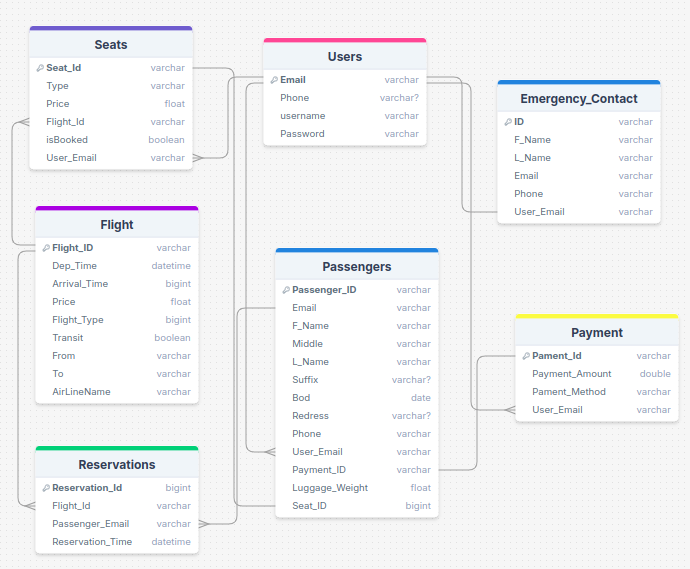

This is a [Next.js](https://nextjs.org) project bootstrapped with [`create-next-app`](https://nextjs.org/docs/app/api-reference/cli/create-next-app).

## Getting Started

First, run the development server:

```bash
npm run dev
# or
yarn dev
# or
pnpm dev
# or
bun dev
```

## Tripma Database Diagram


https://drawsql.app/teams/sherif-mohammed/diagrams/tripma-flight-booking-system

## Tripma API Documentation

https://app.swaggerhub.com/apis/SHERIFABDELSALAM111/Tripma_FlightBookingSystem/1.0.0#/
